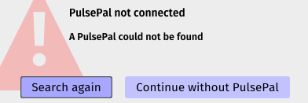
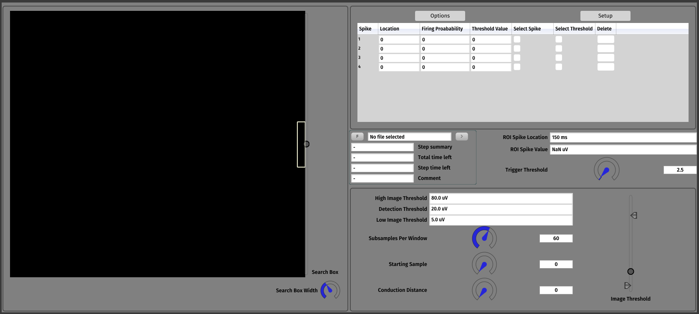
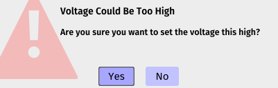

# Latency Tracker Plugin
This plugin extends the functionality of the [Open Ephys GUI](https://github.com/open-ephys/plugin-GUI) to support experiments in microneurography, and track constant latency evoked responses.

## Resources

The Open Ephys team is moving their documentation from [atlassian](https://open-ephys.atlassian.net/wiki/spaces/OEW/pages/491527/Open+Ephys+GUI) to [GitHub](https://open-ephys.github.io/gui-docs/User-Manual/Installing-the-GUI.html), however this has not yet been completed so I would suggest to refer to the atlassian documentation for now.

## Installation

1. [Compile the main GUI](https://open-ephys.atlassian.net/wiki/spaces/OEW/pages/491621/Windows). 

>Note that [ZMQ plugins](https://github.com/open-ephys-plugins/ZMQPlugins) and [HDF5 Plugins](https://github.com/open-ephys-plugins/HDF5Plugins) are no longer shipped by default with the code base and can be **downloaded**, [built and installed](https://open-ephys.atlassian.net/wiki/spaces/OEW/pages/1259110401/Plugin+CMake+Builds) from their own repositories. Follow the steps in the related pages to do so.

2. Clone the plugin repo
3. Install [cmake](https://cmake.org/download/)
4. [Create the build files](https://open-ephys.atlassian.net/wiki/spaces/OEW/pages/1301643269/Creating+Build+files).
5. [Compile plugin](https://open-ephys.atlassian.net/wiki/spaces/OEW/pages/1259110401/Plugin+CMake+Builds)

When compiling via Visual Studio, various header files and libraries will be required. To save time, be sure to add the following files to the Include Directories of the ALL-BUILD project.  
These can be found inside of the main GUI directory, **plugin-GUI-master**  

- \PluginGenerator\JuceLibraryCode\
- \Plugins\Headers\
- \JuceLibraryCode\
- \Source\

Alongisde those, the open-ephys.lib needs to be linked to the OE-plugin-latency-tracker-main project  
This can be found in:   
**.\plugin-GUI-master\Build\Debug\open-ephys.lib**

## Walkthrough

This plugin is intened for use alongside the Pulse Pal. However, it can be used without. If not detected, a prompt will display upon starting the plugin, as shown here:

    

If not using a Pulse Pal, or using legacy data, please click "Continue without PulsePal"

Visualiser for the plugin:

    

**The GUI is currently under refurbishment, bear with us!**

> Trigger Channel and Data Channel: Set to corresponding channels on Pulse Pal and Recording Device

> Trigger Threshold: 

> Subsamples Per Window: 

> Starting Sample: Can be increased/decreased

> Image Threshold Values

> 

#### Spike Tracking  
The Threshold Values are used to detct spikes in the search box. If the spike magnitude exceeds the detection threshold, and the Track Spike button has been toggled, the spike will be tracked via the search box

#### Stimulus Voltage  

By default, the Stimulus Voltage is set at 3, while the Maximum Stimulus Voltage is set to 10. If the Stimulus Voltage is increased past 4 volts, a warning prompt will appear, alerting the user.

    

## Keybinds

The following keybinds can be used to adjust settings:

| Key               | Binding                                                                |
|--------------     |------------------------------------------------------------------------|
| Up Arrow          | Increase Starting Sample Value            |
| Down Arrow        | Decrease Starting Sample Value            |
| +                 | Increase Search Box Location Value        |
| -                 | Decrease Search Box Location Value        |

## Development
Please note, this plugin is still in development. Any suggestions/questions should be directed to PUT CONTACT HERE 