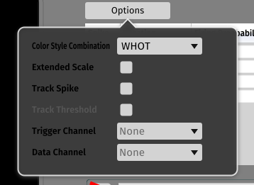

# APTrack - latency tracking plugin for open-ephys

This plugin extends the functionality of the [Open Ephys GUI](https://github.com/open-ephys/plugin-GUI) to support experiments in microneurography, and track constant latency evoked responses.

## Resources

The Open Ephys team is moving their documentation from [atlassian](https://open-ephys.atlassian.net/wiki/spaces/OEW/pages/491527/Open+Ephys+GUI) to [GitHub](https://open-ephys.github.io/gui-docs/User-Manual/Installing-the-GUI.html), however this has not yet been completed so I would suggest referring to the atlassian documentation for now.

### Getting Started with Open-Ephys and LfpLatency Plugin
#### Step 1: Compiling Open-Ephys
**Pre-requisities: cmake, git, (git bash for Windows), (Virtual Studio 2019 for Windows)**
We recommend compiling on Windows.

	1. Go to a place in your local directory. For ease of communication, this directory will be called ~/home
	2. Open a terminal in ~/home, type git clone https://github.com/open-ephys/plugin-GUI.git
##### For Windows Users:
	3. Navigate to ~home/plugin-GUI/Build via command prompt
	4. Enter the following command: cmake -G "Visual Studio 16 2019" -A x64 ..
	5. In Visual Studio, select the open-ephys.sln file from the Build folder.
	6. Optional: From the Build menu, select Configuration Manager, then select Release
	7. Select Build/Build Solution (or press F6) to build the GUI from source or hit the Debug/Release button to build and run. 
	
***N.B. The Release version runs significantly better than debug, but will take longer.***

##### For Mac Users:
	3. Navigate to ~home/plugin-GUI/Build via command prompt
	4. Enter the following command: cmake -G "Xcode" ..
	5. In Xcode, select the open-ephys code project file.
	6. Set the active scheme to install
	7. Build the current scheme by pressing the play button

##### For Linux Users:
	3. Install the Linux dependencies by running sudo ./install_linux_dependencies.sh in the Resources/Scripts folder.
	4. From the same directory, enter: sudo cp 40-open-ephys.rules /etc/udev/rules.d
	5. Enter: sudo service udev restart on Ubuntu/Debian or sudo udevadm control --reload-rules on Fedora/CentOS. These last two steps will allow your computer to communicate with the Open Ephys acquisition board.
	6. Navigate to ~/home/plugin-GUI/Build via command prompt
	7. Type cmake -G "Unix Makefiles" -DCMAKE_BUILD_TYPE=Release .. to create the build files.
	8. Type make to build the main application. If this fails, you are probably missing dependencies (see above, and please let us know if any dependencies are missing from the instructions). 

If the above steps are successful, there will be a compiled binary at Build/Debug/open-ephys

#### Step 2: Building the Microneurography Plugin
	1. Return to ~/home
	2. Clone the plugin github here

**If you chose debug above, you must continue with debug with the plugin.**
##### For Windows Users:
	3. Repeat all previous Windows steps for the GUI, except now for the plugin. Except this time, choose the install option on the right hand side:
	Copy all files from ~home/OE-plugin-latency-tracker/Build/Release and paste into ~home/plugin-GUI/Build/Release/plugins

    

##### For Linux users
	3. Repeat steps 6, 7 and 8 for the plugin.
	4. Copy all files from ~home/OE-plugin-latency-tracker/Build/Release and paste into ~home/plugin-GUI/Build/Release/plugins

##### For Mac users
	3. Repeat steps 3, 4, 5, 6, and 7 for the plugin
	4. Copy all files from ~home/OE-plugin-latency-tracker/Build/Release and paste into ~home/plugin-GUI/Build/Release/plugins

	

##### To use Github Actions
	1. Click on Actions in this repo
	2. On the left side, you should see several workflows. 
      	1. To see it compiles on Ubuntu 20.04: Click on "Build LfpLatency", which will compile the plugin (approximate runtime 1.5 min).
      	2. To see it compiles on MacOs 10.15: Click on"Build plugin-gui macos", which will compile the plugin-gui first and then the plugin (approximate runtime 5 min).
	3. Click run workflow, and choose which branch you want to compile
	4. Click the green button, "Run workflow"
	5. After a few seocnds, the workflow should be in progress. You can click it to see details
	6. Output information is provided on compile success/failure

	

	

	

### To use the Docker
We aim to get a easier deployment solution through Docker, but for now it's only used in GitHub Actions to check if a branch compiles
The image can compile the plugin, but cannot run the plugin-GUI due to audio device issues

### Walkthrough
You should now find an executable called open-ephys in ~home/GUI-plugin/Build/Release (Or debug if you chose that option.)
When launched, you should see LfpLatency in the list of sinks, in the Processors panel on the left.

    

Drag it to the signal chain on the bottom of the screen.
Then press the left tab button, this will launch it into the GUI:

    

A prompt will display, which allows you to load in a previously used configuration. The file this configuration is stored in is **LastLfpLatencyPluginComponents**

	

This plugin is intened for use alongside the Pulse Pal. However, it can be used without. If not detected, a prompt will display upon starting the plugin, as shown here:

    

If not using a Pulse Pal, or using legacy data, please click "Continue without PulsePal"

Visualiser for the plugin:

    

> Trigger Threshold: If exceeded in the trigger channel, a new will be added.

> Subsamples Per Window: Number of samples used per 'track' displayed on the plot. It can be thought of as an inverse 'zoom' scale - As the number of values plotted in a given space increases the figure zooms out.

> Starting Sample: If exceeded by the by a sample, it will be stored as a new peak.

> Image Threshold Values: These are the limits for the colour scale on the plot, and the spike tracking algorithm.

There are two additional drop down tabs: Setup and Options

Options:

	

> Trigger Channel and Data Channel: Used to set the corresponding channels on Pulse Pal and Recording Device.

> Colour Style Combination: Used to adjust the graphics displayed in the search window.

Setup:

	

This is where the stimulus voltage and rates of spike tracking can be adjusted.

#### Spike Tracking  
The plugin supports the tracking of multiple neuronal spikes, which are recorded in the table.

	

The table above can be used to track multiple spikes/thresholds. Any found will be added to the table. They can be tracked and deleted from the table.

#### To Track Spikes/Threshold
	1. Select a Track Spike/Track Threshold button from the Table
	2. This will change the search box colour to the assigned colour of the row. Use the slider to position it.
	3. Once a spike is found, the search box will turn green, and an indicator at the bottom of the search box will display. The location of the spike, its firing probability, and/or stimulus threshold will be shown in the table.
	4. The spike/threshold will be automatically selected, and the search box slider/ stimulus voltage will be adjusted. To deselect a spike/threshold, simply toggle the buttons in the table
	5. To delete a spike/threshold, hold down its corresponding delete button in the table.

	

	

	

#### Stimulus Voltage  

By default, the Stimulus Voltage is set at 3, while the Maximum Stimulus Voltage is set to 10. If the Stimulus Voltage is increased past 4 volts, a warning prompt will appear, alerting the user.

    

### PulsePal integration

The pulsepal controller allows for loading 'playlists' for stimulus paradigms. 
First load the paradigm by pressing the `F` button (this will only be enabled if the pulsepal was detected at startup). Once loaded the playlist can be started with the `>` button.

    

The playlist file expected is a "csv" with the structure ([example](Resources/example_playlist.csv)) :

| Duration (s) | Voltage (V)* | Rate (Hz) | Comment
| -- | -- | -- |-- |
| 60 | 1* | 0.5 | first phase stimulation
| 60 | 1* | 1 | faster stimulation
| 10 | 1* | 0 | a 10s pause

\* "Voltage" is ignored by the plugin, but kept for future development. 

If a recording is active, each event in the playlist is sent to the `all.messages` file.

    

When started the playlist will run until the playlist is complete, displaying the current step in the dialog box. It can also be stopped with the `[ ]` button. The playlist can be restarted by pressing the `>` again.

The pulsepal will send:

* Channel 1: a 0.0005s square output with the voltage set within the plugin. 
* Channel 2: a 0.0005s square output with a constant 10V output
* Channel 3: a 0.0105s square output with a constant 10V output offset by -0.005s
	- This may be used to open a relay during stimulation

## Key binds

The following key binds can be used to adjust settings:

| Key               | Binding                                                                |
|--------------     |------------------------------------------------------------------------|
| Up Arrow          | Increase Starting Sample Slider             |
| Down Arrow        | Decrease Starting Sample Slider             |
| Right Arrow       | Increase Search Box Location                |
| Left Arrow        | Decrease Search Box Location                |
| +                 | Increase Subsamples per Window Value        |
| -                 | Decrease Subsamples per Window Value        |
| Page Up           | Increase High Image Threshold               |
| Page Down         | Decrease High Image Threshold               |
| Home              | Increase Low Image Threshold                |
| End               | Decrease Low Image Threshold                |
| F1/F2/F3/F4		| Track Spikes 1 - 4						  |

All these binds work on a number pad, except the function keys.

## Development
Please note, this plugin is still in development. Any suggestions/questions should be directed to the contributors

## Copyright

------------------------------------------------------------------

APTrack, a plugin for the Open-Ephys Gui

Copyright (C) 2019-2023 Eli Lilly and Company, University of Bristol, Open Ephys
Authors: Aidan Nickerson, Grace Stangroome, Merle Zhang, James O'Sullivan, Manuel Martinez
------------------------------------------------------------------

This program is free software: you can redistribute it and/or modify
it under the terms of the GNU General Public License as published by
the Free Software Foundation, either version 3 of the License, or
(at your option) any later version.

This program is distributed in the hope that it will be useful,
but WITHOUT ANY WARRANTY; without even the implied warranty of
MERCHANTABILITY or FITNESS FOR A PARTICULAR PURPOSE.  See the
GNU General Public License for more details.

You should have received a copy of the GNU General Public License
along with this program.  If not, see <http://www.gnu.org/licenses/>.

